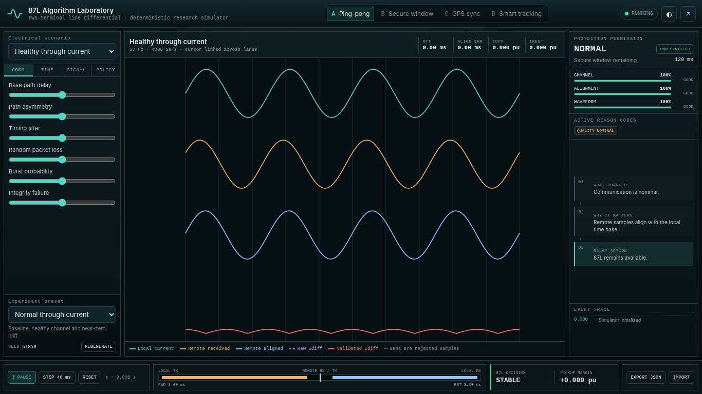

# Line Differential Relay Algorithm Laboratory

> A deterministic, one-screen, industrial 87L simulator for teaching and researching how communication quality, packet delivery, time alignment, confidence, and security logic affect line differential protection.

[](LICENSE)
[](https://github.com/masarray/line-differential-relay-lab/actions/workflows/ci.yml)
[](https://github.com/masarray/line-differential-relay-lab/actions/workflows/pages.yml)
[](https://github.com/masarray/line-differential-relay-lab/actions/workflows/monte-carlo-validation.yml)

## Why this project exists

Line differential protection is easy to write as an equation but much harder to understand when remote samples arrive with asymmetric delay, jitter, sequence gaps, duplicates, reordering, queue overflow, corruption, or route changes. This laboratory keeps the complete cause-and-effect chain visible in one laptop viewport:

```text
communication disturbance
        ↓
received remote waveform
        ↓
time alignment / validation
        ↓
raw and validated Idiff
        ↓
confidence and protection permission
        ↓
STABLE / SECURE WINDOW / BLOCKED / OPERATE
```

The application is intended for technical training, demonstrations, and algorithm research. It is not a certified relay or a source of operational settings.



## Algorithm modes

| Mode | Alignment method | Communication security behaviour |
|---|---|---|
| Conventional RTT/2 | `RTT / 2` | Baseline behaviour; only hard-invalid data is rejected |
| Communication-supervised RTT/2 | `RTT / 2` | Watch, bounded ride-through, expiry block, recovery validation |
| Absolute-time reference | Common sample time | Channel-delay tolerant while time quality remains valid |
| Smart waveform-assisted | RTT/2 coarse estimate + bounded dual-horizon tracking | Uses waveform evidence and delay trajectory, but hard failures still block 87L |

The project does not reproduce, benchmark, or claim equivalence with any manufacturer’s proprietary relay algorithm.

## Current capabilities

- Local, remote received, remote aligned, raw Idiff, and validated Idiff waveforms
- Through current, load step, external fault, internal fault, and CT-error scenarios
- Sequence-numbered packet frames instead of independent sample-drop simulation
- Path asymmetry, jitter, random and burst loss, corruption, duplicates, reordering, packet age, queue overflow, and route step/ramp
- Receiver-only smart tracking with short-horizon and stability estimators, sub-sample lag refinement, agreement gating, and bounded delay trajectory
- Measured-only protection evidence; interpolation remains tracking-only
- Channel, alignment, and waveform confidence as separate rails
- Protection state machine with reason codes and secure-window countdown
- Generic virtual 87L relay with live indicators, LCD mimic, and manual-reset latched TRIP memory
- Deterministic presets, pause, single-step, reset, seed regeneration, import, and export
- Blind Monte Carlo comparison with security, dependability, operating-time, supervision, availability, packet, and alignment metrics
- Canvas rendering and Web Worker simulation with no runtime dependencies
- Responsive industrial UI optimized for 1280 × 720 and larger laptop screens
- Automated tests, CodeQL, CI report artifacts, and GitHub Pages deployment

## Run locally

Requirements: Node.js 20 or newer.

```bash
npm install
npm run dev
```

Open `http://localhost:4173`.

## Validate and build

```bash
npm run validate
```

Validation performs syntax checks, regression tests, a compact deterministic Monte Carlo campaign, and the production build. The production site is written to `dist/` and the smoke report to `artifacts/validation/`.

## Blind Monte Carlo validation

Run the default campaign:

```bash
npm run benchmark
```

Run a larger deterministic comparison:

```bash
npm run benchmark -- --cases 500 --seed 61850
```

Select modes explicitly:

```bash
npm run benchmark -- --algorithms ping-pong,secure-window,smart-tracking
```

The default comparison excludes the absolute-time reference because the principal research path does not depend on an external timestamp source. Add it explicitly with `--include-gps`.

Reports:

```text
artifacts/validation/monte-carlo-report.json
artifacts/validation/monte-carlo-report.md
```

Each generated case is replayed with the same plant and packet disturbance across all selected modes. Ground truth is read only by the post-frame evaluator and is never fed into alignment, confidence, protection permission, Idiff, or trip logic.

## Deploy to GitHub Pages

1. Create a public repository and push this project to the `main` branch.
2. Replace repository metadata when publishing a fork.
3. In **Settings → Pages**, select **GitHub Actions** as the source.
4. Push to `main`, or run the **Deploy GitHub Pages** workflow manually.

The build uses relative asset URLs, so the same output works at:

```text
https://<username>.github.io/line-differential-relay-lab/
```

## Engineering model

The educational default uses terminal currents positive into the protected zone:

```text
Through current:  I_local ≈ -I_remote  → Idiff ≈ 0
Internal fault:   I_local and I_remote enter the zone → Idiff rises
```

The protection characteristic uses a configurable minimum pickup and percentage-restraint slope. All displayed thresholds are simulation policy defaults, not field recommendations.

See:

- [Architecture](docs/ARCHITECTURE.md)
- [Algorithm notes](docs/ALGORITHM_NOTES.md)
- [Validation strategy](docs/VALIDATION.md)
- [Product requirements summary](docs/PRD.md)
- [Roadmap](docs/ROADMAP.md)

## Safety and limitations

- Do not connect this application to trip circuits or operational protection systems.
- Do not use the default values as relay settings.
- Do not infer vendor-specific proprietary behaviour from the educational models.
- Monte Carlo results are simulator evidence, not protection-relay certification.
- Validate all protection concepts independently before any practical application.

## License

Copyright © 2026 Mas Ari and contributors.

Licensed under the [GNU General Public License v3.0 only](LICENSE). Derivative works distributed to others must remain under GPL-compatible terms and provide corresponding source as required by the license.
